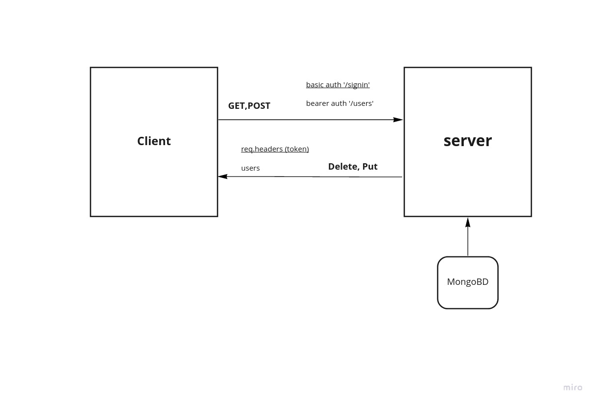

# auth-server

# LAB - Class 14

## Installation

- On your terminal

- `git clone https://github.com/ahmadkheder-401-advanced-javascript/auth-server.git`
- `npm install`
- `sudo systemctl start mongod`
- `node .`

## Test

`npm test __test__/auth.router.test.js`

**dependencies:**
`express,jest, @code-fellows/supergoose,jsonwebtoken, morgan, base46, cors`

# UML diagram

